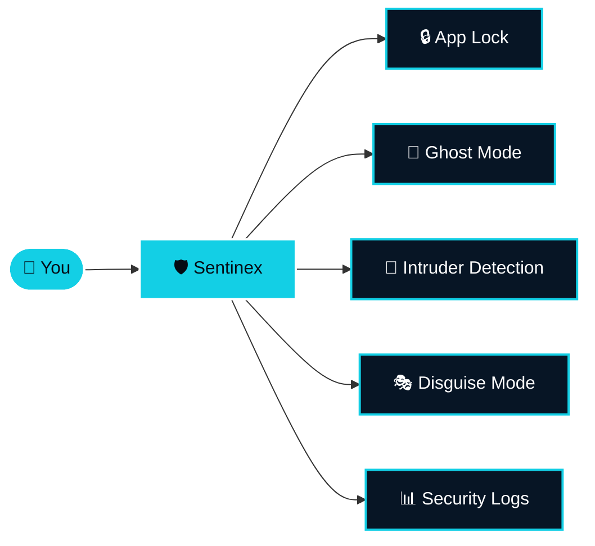

 

  

## 🛡️ About Sentinex

**Sentinex** is an Android security application designed to protect your private apps and personal data with lightweight privacy and security features.

## ✨ Features

| Feature | Description |
|:---|:---|
| 🔒 **App Lock** | Protect selected applications with a secure lock. |
| 👻 **Ghost Mode** | Hide the normal interface with a protected screen. |
| 📸 **Intruder Detection** | Capture unauthorized access attempts. |
| 🎭 **Disguise Mode** | Make Sentinex appear like another application. |
| 📊 **Security Logs** | View security-related activity. |
| ⚡ **Lightweight** | Designed to work efficiently on Android devices. |

## 📱 Versions

| | 🛡️ Sentinex Secure | ⚡ Sentinex Lite |
|:---|:---:|:---:|
| **Best for** | Full security & privacy | Essential security |
| **Latest version** | `v1.0.2` | `v1.0.1` |

- 🛡️ **Sentinex Secure** is the full version with advanced security and privacy features.
- ⚡ **Sentinex Lite** is the lightweight version for users who want essential security features.

## 📦 Downloads

The latest Android APK releases will be available through GitHub Releases.

## 🌐 Official Links

| | Link |
|:---|:---|
| 🛡️ Sentinex Website | https://heetdevlab.github.io/Sentinex/ |
| 🌐 HeetDevLab Website | https://heetdevlab.github.io/ |
| 🔐 Privacy Policy | https://heetdevlab.github.io/Sentinex/privacy/ |

## 🔐 Privacy

Sentinex is designed with privacy in mind. Read the full privacy policy here:

👉 https://heetdevlab.github.io/Sentinex/privacy/

## 📸 Screenshots

> Screenshots and additional information will be added here.

<!--
Jab screenshots ready ho jaye to ye block uncomment karke use karna:

-->

## 🏗️ Development

Sentinex is developed and maintained by **HeetDevLab**, building Android applications, web tools and software projects.

  

**Made with 💙 by HeetDevLab**

